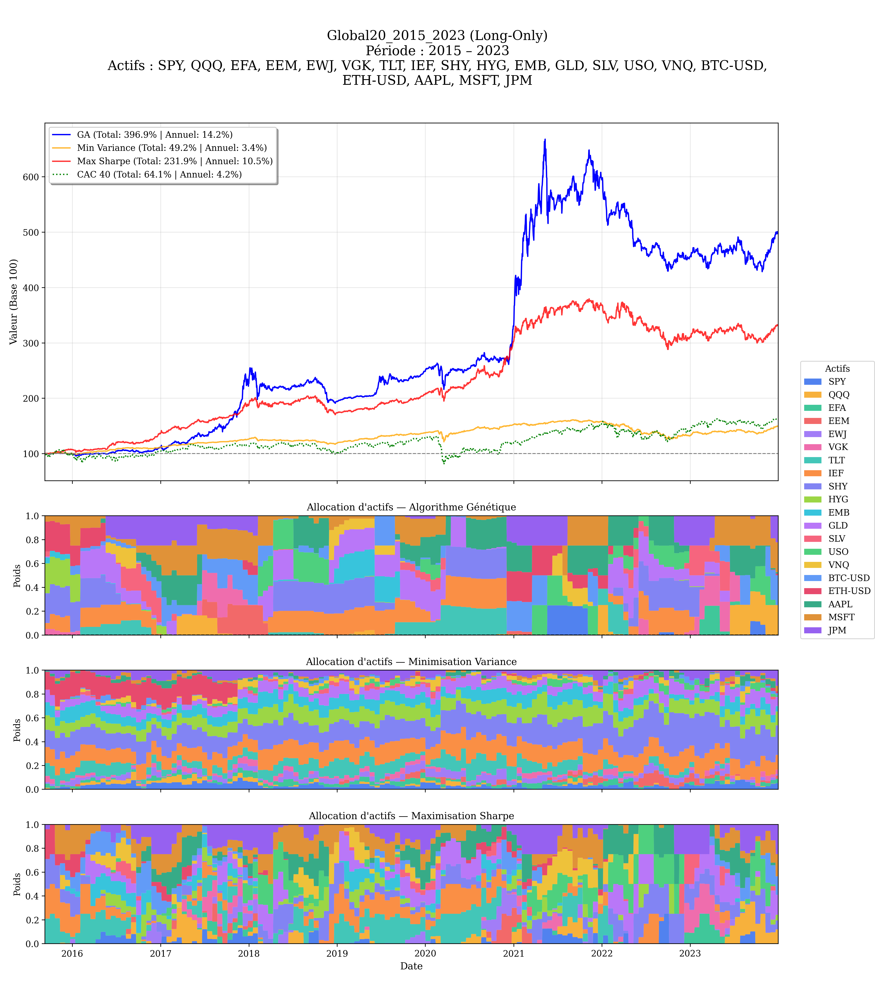
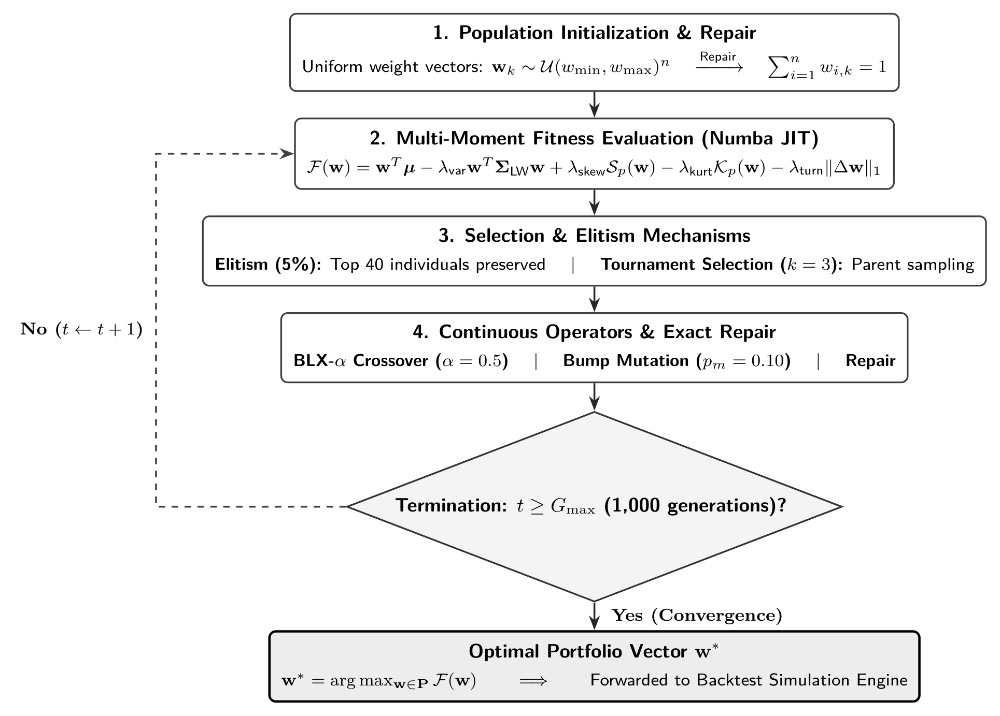
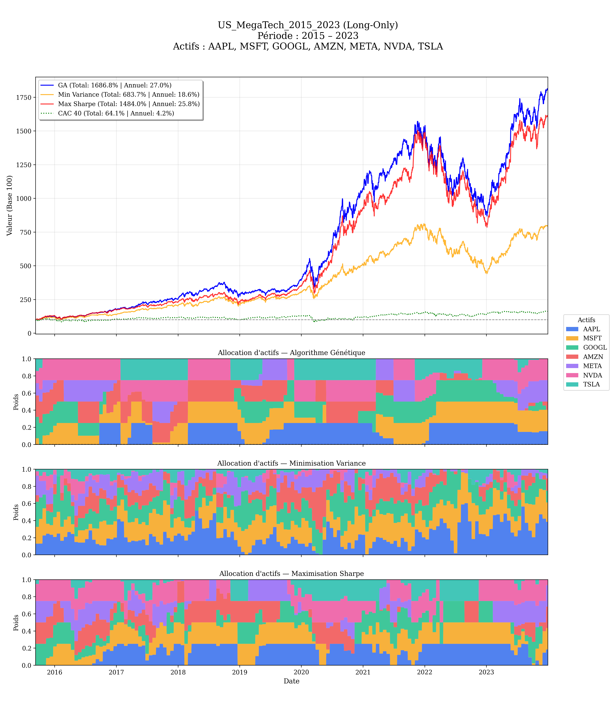
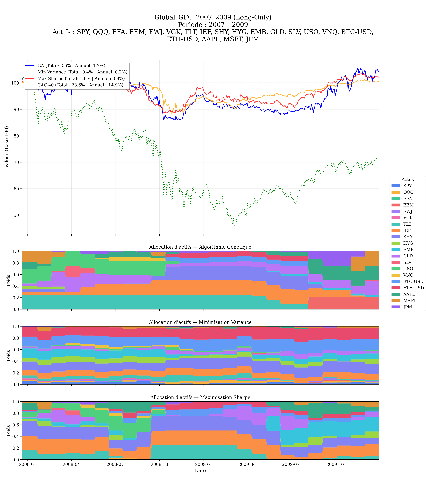
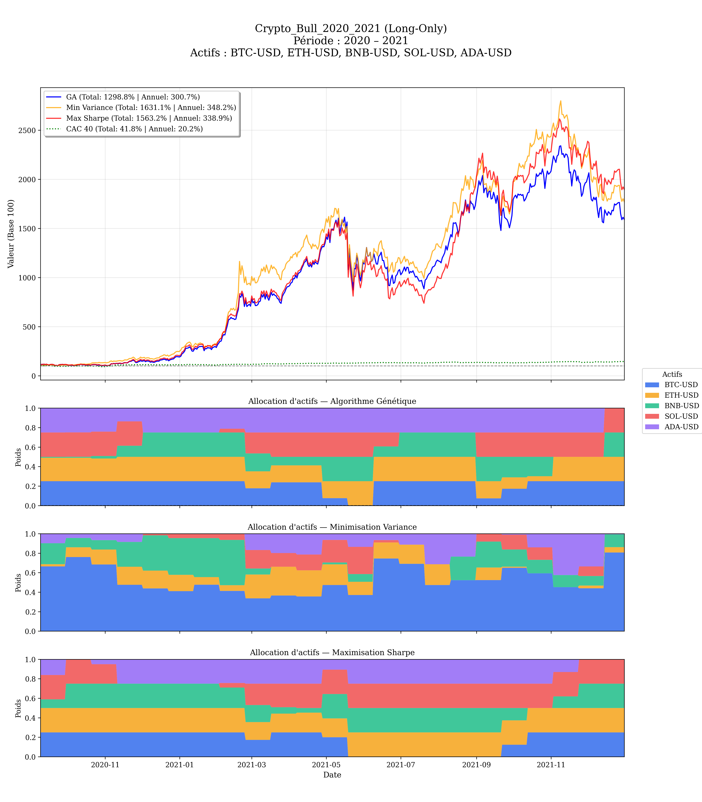
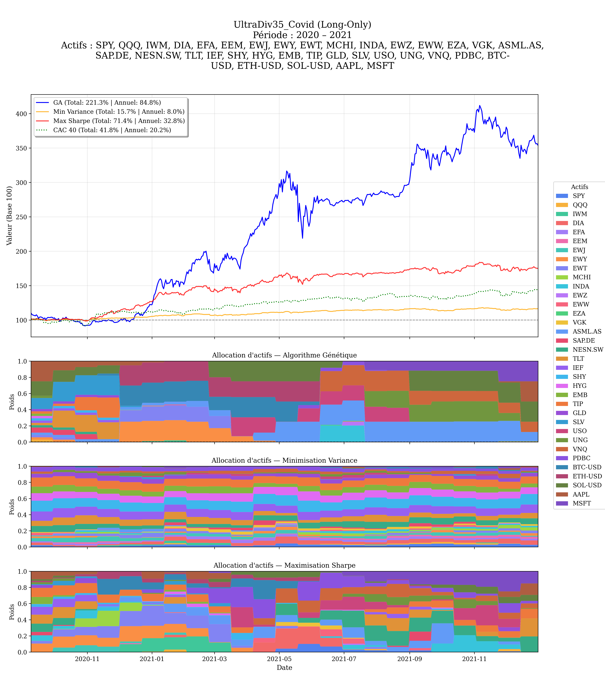
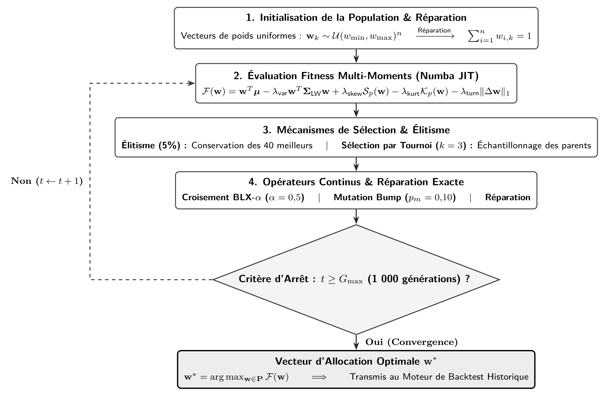

# Portfolio Optimization with Genetic Algorithm — PE 27

[](https://www.python.org/)
[](https://numpy.org/)
[](https://numba.pydata.org/)
[](https://scipy.org/)
[](https://pandas.pydata.org/)
[](https://scikit-learn.org/)
[](https://matplotlib.org/)

[English](#english) • [Français](#français) • [Rapport PDF](Rapport%20final%20du%20projet.pdf)

---

## English

### Project Overview

This project implements a **Genetic Algorithm (GA)** accelerated with Numba for dynamic financial portfolio optimization and asset allocation. 

Traditional Markowitz mean-variance optimization assumes normally distributed asset returns and static covariance matrices. In contrast, this engine integrates **higher-order statistical moments (skewness, kurtosis)**, dynamic transaction costs (**turnover penalties**), robust shrinkage covariance estimation (**Ledoit-Wolf**), and EMA trend estimators.

The algorithm is backtested across over **160+ market scenarios** (GFC 2008, Eurozone crisis, COVID-19 shock, 2022 rate hikes, crypto cycles, multi-asset classes) and benchmarked against classical quantitative strategies (**Minimum Variance via Newton-Raphson** and **Maximum Sharpe Ratio via SLSQP**) as well as market indices (**CAC 40**).

<p align="center">
  
  <br>
  <em>Dynamic multi-asset backtest and weight allocations: Genetic Algorithm vs. Min-Variance vs. Max-Sharpe vs. Benchmark (2015–2023)</em>
</p>

---

### Mathematical Formulation & Objective Function

The objective is to find the optimal weight vector $\mathbf{w} = (w\_1, \dots, w\_n)^T$ that maximizes the multi-objective fitness function $\mathcal{F}(\mathbf{w})$ while strictly enforcing portfolio budget and position constraints.

#### Multi-Moment Fitness Function

```math
\mathcal{F}(\mathbf{w}) = \mu_p(\mathbf{w}) - \lambda_{\text{var}} \, \sigma_p^2(\mathbf{w}) + \lambda_{\text{skew}} \, \mathcal{S}_p(\mathbf{w}) - \lambda_{\text{kurt}} \, \mathcal{K}_p(\mathbf{w}) - \lambda_{\text{turn}} \, \mathcal{T}(\mathbf{w}, \mathbf{w}_{\text{prev}})
```

Where the individual components are defined as:

- **Expected Portfolio Return:** $\mu\_p(\mathbf{w}) = \mathbf{w}^T \boldsymbol{\mu}$
- **Portfolio Variance (Ledoit-Wolf Shrinkage):** $\sigma\_p^2(\mathbf{w}) = \mathbf{w}^T \boldsymbol{\Sigma}\_{\text{LW}} \mathbf{w}$
- **Portfolio Skewness (favors positive tail gains):** $\mathcal{S}\_p(\mathbf{w}) = \mathbb{E}[((r\_p - \mu\_p) / \sigma\_p)^3]$
- **Portfolio Centered Kurtosis (penalizes crash risks):** $\mathcal{K}\_p(\mathbf{w}) = \mathbb{E}[((r\_p - \mu\_p) / \sigma\_p)^4] - 3$
- **Turnover Friction (Transaction Cost Penalty):** $\mathcal{T}(\mathbf{w}, \mathbf{w}\_{\text{prev}}) = \sum\_{i=1}^n |w\_i - w\_{\text{prev}, i}|$

The hyperparameters $\lambda\_{\text{var}}, \lambda\_{\text{skew}}, \lambda\_{\text{kurt}}, \lambda\_{\text{turn}} \ge 0$ control risk aversion, moment preferences, and trading friction penalties.

#### Market Parameter Estimators

1. **Covariance Matrix ($\boldsymbol{\Sigma}$):** Estimated using the **Ledoit-Wolf shrinkage estimator** ($\boldsymbol{\Sigma}\_{\text{LW}}$) to handle high-dimensional collinearity and sample noise over short lookback windows.
2. **Expected Returns ($\boldsymbol{\mu}$):** Computed via Dual Exponential Moving Average (**EMA-40 / EMA-200**) momentum filters:

```math
\mu_i = \frac{\text{EMA}_{\text{fast}}(P_i)}{\text{EMA}_{\text{slow}}(P_i)} - 1
```

#### Portfolio Constraints

- **Long-Only mode:**

```math
\sum_{i=1}^n w_i = 1 \quad \text{with} \quad w_i \in [w_{\min}, w_{\max}], \; w_{\min} \ge 0
```

- **Long/Short mode:**

```math
\sum_{i=1}^n |w_i| = 1 \quad \text{with} \quad w_i \in [w_{\text{short}}, w_{\max}]
```

---

### Genetic Algorithm Architecture

<p align="center">
  
  <br>
  <em>Figure: Full algorithmic architecture and mathematical operators of the portfolio genetic optimizer</em>
</p>

#### Detailed Mathematical Formalism of Genetic Operators

##### 1. Chromosome Representation & Admissible Space

Each candidate solution is a continuous weight vector $\mathbf{w} = (w\_1, \dots, w\_n)^T \in \mathbb{R}^n$ defined over the constrained budget domain:

```math
\mathcal{W} = \left\{ \mathbf{w} \in \mathbb{R}^n \mid \sum_{i=1}^n w_i = 1 \quad \text{and} \quad w_{\min} \le w_i \le w_{\max}, \quad \forall i \in \{ 1, \dots, n \} \right\}
```

##### 2. Multi-Moment Objective Function (Numba JIT Accelerated)

The fitness value balances expected return, robust variance, higher-order statistical moments, and transaction costs:

```math
\mathcal{F}(\mathbf{w}) = \mathbf{w}^T \boldsymbol{\mu} - \lambda_{\text{var}} \, \mathbf{w}^T \boldsymbol{\Sigma}_{\text{LW}} \mathbf{w} + \lambda_{\text{skew}} \, \mathcal{S}_p(\mathbf{w}) - \lambda_{\text{kurt}} \, \mathcal{K}_p(\mathbf{w}) - \lambda_{\text{turn}} \, \|\mathbf{w} - \mathbf{w}_{\text{prev}}\|_1
```

where $\mathcal{S}\_p(\mathbf{w})$ favors positive asymmetric returns and $\mathcal{K}\_p(\mathbf{w})$ penalizes fat-tail crash risk.

##### 3. Elitism (5%) & Tournament Selection ($k=3$)

- **Elitism:** The top $N\_{\text{elite}} = \lfloor 0.05 \cdot N\_{\text{pop}} \rfloor$ solutions with the highest $\mathcal{F}(\mathbf{w})$ are directly preserved without crossover or mutation.
- **Tournament Selection:** For each parent, 3 candidates $\{ i\_1, i\_2, i\_3 \}$ are sampled uniformly from $\{ 1, \dots, N\_{\text{pop}} \}$, and the fittest individual is selected:

```math
p = \arg\max_{i \in \{ i_1, i_2, i_3 \}} \mathcal{F}(\mathbf{w}_i)
```

##### 4. Continuous BLX - $\alpha$ Crossover ($\alpha = 0.5$)

Given two parents $\mathbf{p}\_1$ and $\mathbf{p}\_2$, each component $c\_i$ of the offspring chromosome $\mathbf{c}$ is independently sampled from an expanded bounding interval:

```math
c_i \sim \mathcal{U}\left(\min(p_{1,i}, p_{2,i}) - \alpha \, d_i, \; \max(p_{1,i}, p_{2,i}) + \alpha \, d_i\right) \quad \text{where} \quad d_i = |p_{1,i} - p_{2,i}|
```

##### 5. Controlled Pairwise Bump Mutation ($p\_m = 0.10$)

To preserve the zero-sum budget constraint, mutation selects a distinct pair of assets $(i, j)$ with $i \neq j$ and applies a shift $\delta \sim \mathcal{U}(0.01, 0.05)$:

```math
\begin{cases}
w_i \leftarrow w_i + \delta \\
w_j \leftarrow w_j - \delta
\end{cases}
\quad \text{subject to} \quad w_i + \delta \le w_{\max} \quad \text{and} \quad w_j - \delta \ge w_{\min}
```

##### 6. Exact Repair Operator

Any perturbation resulting in a budget deficit or surplus $\Delta = 1 - \sum\_{i=1}^n w\_i \neq 0$ is iteratively projected onto the feasible domain by proportional redistribution according to individual capacity:

```math
R_i = \begin{cases}
w_{\max} - w_i & \text{if } \Delta > 0 \\
w_i - w_{\min} & \text{if } \Delta < 0
\end{cases}
\implies w_i \leftarrow \mathrm{clip}\left(w_i + \Delta \cdot \frac{R_i}{\sum_{j=1}^n R_j}, \; w_{\min}, \; w_{\max}\right)
```

This ensures numerical convergence to $\sum w\_i = 1$ in $\le 5$ iterations.

---

### Results & Visual Comparisons

<p align="center">
  
  
</p>
<p align="center">
  
  
</p>

#### Quantitative Empirical Results (159 Real Backtest Scenarios)

The automated test suite evaluates performance across standard financial indicators and tail-risk metrics from `resultats.csv` (Configuration 2):

##### 1. Overall Median Performance Across All 159 Scenarios

| Model | Return (p.a.) | Volatility | Sharpe | Sortino | Max DD | Calmar | VaR 95% | CVaR 95% | Turnover |
| :--- | :---: | :---: | :---: | :---: | :---: | :---: | :---: | :---: | :---: |
| **Genetic Algorithm (PE 27)** | **+9.73%** | 16.82% | **0.528** | **0.587** | **-29.82%** | **0.333** | -1.61% | -2.58% | **0.138** |
| **Maximum Sharpe (SLSQP)** | +8.05% | 14.74% | 0.503 | 0.548 | -27.17% | 0.331 | -1.39% | -2.24% | 0.313 |
| **Minimum Variance (NR)** | +4.70% | **12.56%** | 0.339 | 0.407 | **-22.85%** | 0.252 | **-1.15%** | **-1.93%** | 0.297 |
| **Benchmark (CAC 40)** | +4.20% | 15.89% | 0.214 | 0.223 | -38.56% | 0.109 | -1.49% | -2.51% | 0.000 |

> [!TIP]
> **Key Takeaway:** The Genetic Algorithm achieves the best risk-adjusted returns (Sharpe **0.528**) and median return (**+9.73%**), while halving turnover compared to classical solvers.

##### 2. Benchmark Case Studies (Selected Scenarios)

| Scenario | Model | Total Ret. | Ann. Ret. | Volatility | Sharpe | Sortino | Max DD | Turnover |
| :--- | :--- | :---: | :---: | :---: | :---: | :---: | :---: | :---: |
| **US MegaTech**<br>*(2015–2023, 7 assets)* | **Genetic Algorithm**<br>Max Sharpe<br>Min Variance<br>CAC 40 | **+1686.8%**<br>+1484.0%<br>+683.7%<br>+64.1% | **27.05%**<br>25.78%<br>18.64%<br>4.20% | 25.21%<br>25.00%<br>**21.07%**<br>15.89% | **0.998**<br>0.964<br>0.823<br>0.214 | **1.096**<br>1.060<br>0.915<br>0.223 | **-44.68%**<br>-47.74%<br>-45.65%<br>-38.56% | **0.121**<br>0.231<br>0.346<br>0.000 |
| **European Equities**<br>*(2010–2023, 15 assets)* | **Genetic Algorithm**<br>Max Sharpe<br>Min Variance<br>CAC 40 | **+404.6%**<br>+281.4%<br>+219.7%<br>+92.9% | **9.81%**<br>8.05%<br>6.95%<br>3.87% | 16.34%<br>15.75%<br>**13.36%**<br>17.31% | **0.534**<br>0.445<br>0.422<br>0.192 | **0.638**<br>0.519<br>0.486<br>0.218 | **-31.89%**<br>-29.73%<br>-33.06%<br>-38.56% | **0.206**<br>0.471<br>0.477<br>0.000 |
| **Ultra-Diversified**<br>*(2015–2023, 35 assets)* | **Genetic Algorithm**<br>Max Sharpe<br>Min Variance<br>CAC 40 | **+866.6%**<br>+245.3%<br>+44.3%<br>+64.1% | **20.73%**<br>10.84%<br>3.09%<br>4.20% | 22.31%<br>12.05%<br>**5.85%**<br>15.89% | **0.868**<br>0.750<br>0.212<br>0.214 | **1.026**<br>0.859<br>0.231<br>0.223 | **-30.09%**<br>-27.17%<br>-18.12%<br>-38.56% | **0.336**<br>0.613<br>0.289<br>0.000 |

---

### Technical Stack & Dependencies

- **Language:** Python 3.9+
- **Just-In-Time Compilation:** `numba` (`@njit`, `prange`)
- **Optimization:** `scipy.optimize` (SLSQP solver for Max Sharpe benchmark)
- **Linear Algebra & Matrix Shrinkage:** `numpy`, `scikit-learn` (`LedoitWolf`)
- **Financial Data Ingestion:** `yfinance`, `pandas`
- **Visualization:** `matplotlib` (multi-panel equity curve and dynamic asset allocation stackplots)
- **Progress & Multiprocessing:** `tqdm`, `concurrent.futures.ProcessPoolExecutor`

---

### Installation & Usage

```bash
# 1. Clone the repository
git clone https://github.com/alexandrehubsch/Portfolio-Optimization-With-Genetic-Algorithm.git
cd Portfolio-Optimization-With-Genetic-Algorithm

# 2. Install dependencies
pip install -r requirements.txt
```

#### Running Scripts:

| Script | Description | Command |
| :--- | :--- | :--- |
| **`main.py`** | Runs a single backtest on configured assets with dynamic stackplot generation | `python main.py` |
| **`general_tests.py`** | Executes the full parallel test suite across all 160+ market scenarios | `python general_tests.py` |
| **`config.py`** | Central configuration file for hyperparameters, weights, windows, and tickers | *Config file* |
| **`test_scenarios.py`** | Scenarios and universe definitions (crises, bull/bear regimes, multi-assets) | *Scenario catalog* |

---

### Repository Structure

```text
Portfolio-Optimization-With-Genetic-Algorithm/
├── backtest_results/             # Historical backtest outputs & PNG visualizations
├── figures/                      # Algorithmic architecture diagrams (TikZ PNG)
├── genetic_algorithm/            # Genetic algorithm core operators (Numba accelerated)
├── classic_optimization.py       # Analytical Newton-Raphson & SLSQP benchmark solvers
├── config.py                     # Global hyperparameters & simulation settings
├── financial_indicators.py       # Portfolio variance, turnover, moments & diversification
├── general_tests.py              # Automated batch execution on scenario catalog
├── market_data.py                # Data loading, log returns & Ledoit-Wolf estimators
├── test_scenarios.py             # Assets and temporal market scenarios
├── Rapport final du projet.pdf   # Complete academic project report (PDF)
├── requirements.txt              # Required Python packages
└── README.md                     # Documentation
```

---

## Français

### Présentation du projet

Ce projet présente un moteur d'**optimisation de portefeuille par Algorithme Génétique (AG)** sur mesure, accéléré par compilation à la volée (**Numba JIT**).

L'optimisation classique de Markowitz (moyenne-variance) repose sur l'hypothèse de rendements gaussiens et néglige les risques extrêmes ainsi que l'impact des frottements de marché. Cet algorithme génétique intègre :
- **Les moments statistiques d'ordre supérieur** (asymétrie / *skewness* et aplatissement / *kurtosis* centrée) pour se prémunir contre les risques de queue de distribution (*fat tails*).
- **Une pénalisation explicite du turnover** pour limiter les frais de courtage et les coûts de transaction lors des rééquilibrages.
- **Un estimateur robuste de covariance** via le rétrécissement de Ledoit-Wolf (*Ledoit-Wolf shrinkage*).
- **Un estimateur de tendance** à base de moyennes mobiles exponentielles (EMA rapide / lente).

---

### Modélisation Mathématique & Fonction de Fitness

La fonction de fitness $\mathcal{F}(\mathbf{w})$ maximisée par l'algorithme génétique s'écrit :

```math
\mathcal{F}(\mathbf{w}) = \mu_p(\mathbf{w}) - \lambda_{\text{var}} \, \sigma_p^2(\mathbf{w}) + \lambda_{\text{skew}} \, \mathcal{S}_p(\mathbf{w}) - \lambda_{\text{kurt}} \, \mathcal{K}_p(\mathbf{w}) - \lambda_{\text{turn}} \, \mathcal{T}(\mathbf{w}, \mathbf{w}_{\text{prev}})
```

Où les différentes composantes sont définies par :

- **Rendement espéré du portefeuille :** $\mu\_p(\mathbf{w}) = \mathbf{w}^T \boldsymbol{\mu}$
- **Variance robuste (Rétrécissement de Ledoit-Wolf) :** $\sigma\_p^2(\mathbf{w}) = \mathbf{w}^T \boldsymbol{\Sigma}\_{\text{LW}} \mathbf{w}$
- **Asymétrie / Skewness (valorise l'asymétrie positive) :** $\mathcal{S}\_p(\mathbf{w}) = \mathbb{E}[((r\_p - \mu\_p) / \sigma\_p)^3]$
- **Aplatissement / Kurtosis (pénalise les risques extrêmes) :** $\mathcal{K}\_p(\mathbf{w}) = \mathbb{E}[((r\_p - \mu\_p) / \sigma\_p)^4] - 3$
- **Frottements de turnover (coûts de transaction) :** $\mathcal{T}(\mathbf{w}, \mathbf{w}\_{\text{prev}}) = \sum\_{i=1}^n |w\_i - w\_{\text{prev}, i}|$

où $\lambda\_{\text{var}}, \lambda\_{\text{skew}}, \lambda\_{\text{kurt}}, \lambda\_{\text{turn}} \ge 0$ sont les hyperparamètres contrôlant l'aversion au risque, les préférences de moments et la pénalité de turnover.

#### Estimateurs des paramètres de marché

1. **Matrice de covariance ($\boldsymbol{\Sigma}$) :** Estimée via le rétrécissement de **Ledoit-Wolf** ($\boldsymbol{\Sigma}\_{\text{LW}}$) pour éliminer le bruit d'échantillonnage.
2. **Rendements espérés ($\boldsymbol{\mu}$) :** Calculés par filtrage de tendance Dual EMA (**EMA-40 / EMA-200**) :

```math
\mu_i = \frac{\text{EMA}_{\text{fast}}(P_i)}{\text{EMA}_{\text{slow}}(P_i)} - 1
```

#### Contraintes de portefeuille

- **Mode Long-Only :**

```math
\sum_{i=1}^n w_i = 1 \quad \text{avec} \quad w_i \in [w_{\min}, w_{\max}], \; w_{\min} \ge 0
```

- **Mode Long/Short :**

```math
\sum_{i=1}^n |w_i| = 1 \quad \text{avec} \quad w_i \in [w_{\text{short}}, w_{\max}]
```

---

### Architecture de l'Algorithme Génétique & Formalisme des Opérateurs

<p align="center">
  
  <br>
  <em>Figure : Architecture algorithmique complète et opérateurs mathématiques de l'optimiseur génétique de portefeuille</em>
</p>

#### Formalisme Mathématique Détaillé des Opérateurs

##### 1. Représentation des Chromosomes & Espace Admissible

Chaque candidat est un vecteur de pondérations continues $\mathbf{w} = (w\_1, \dots, w\_n)^T \in \mathbb{R}^n$ sur le domaine budgétaire contraint :

```math
\mathcal{W} = \left\{ \mathbf{w} \in \mathbb{R}^n \mid \sum_{i=1}^n w_i = 1 \quad \text{et} \quad w_{\min} \le w_i \le w_{\max}, \quad \forall i \in \{ 1, \dots, n \} \right\}
```

##### 2. Fonction Objectif Multi-Moments (Accélération Numba JIT)

Le score de fitness arbitre le rendement espéré, la variance robuste, les moments statistiques d'ordre supérieur et les coûts de réallocation :

```math
\mathcal{F}(\mathbf{w}) = \mathbf{w}^T \boldsymbol{\mu} - \lambda_{\text{var}} \, \mathbf{w}^T \boldsymbol{\Sigma}_{\text{LW}} \mathbf{w} + \lambda_{\text{skew}} \, \mathcal{S}_p(\mathbf{w}) - \lambda_{\text{kurt}} \, \mathcal{K}_p(\mathbf{w}) - \lambda_{\text{turn}} \, \|\mathbf{w} - \mathbf{w}_{\text{prev}}\|_1
```

où $\mathcal{S}\_p(\mathbf{w})$ valorise l'asymétrie positive des gains et $\mathcal{K}\_p(\mathbf{w})$ pénalise le risque de perte extrême (*fat tails*).

##### 3. Élitisme (5%) & Sélection par Tournoi ($k=3$)

- **Élitisme :** Les $N\_{\text{elite}} = \lfloor 0{,}05 \cdot N\_{\text{pop}} \rfloor$ meilleurs vecteurs selon $\mathcal{F}(\mathbf{w})$ sont dupliqués directement sans altération dans la génération $t+1$.
- **Sélection par Tournoi :** Pour chaque parent, 3 candidats $\{ i\_1, i\_2, i\_3 \}$ sont tirés uniformément dans $\{ 1, \dots, N\_{\text{pop}} \}$ et le meilleur est retenu :

```math
p = \arg\max_{i \in \{ i_1, i_2, i_3 \}} \mathcal{F}(\mathbf{w}_i)
```

##### 4. Croisement Barycentrique Continu BLX-$\alpha$ ($\alpha = 0{,}5$)

À partir de deux parents $\mathbf{p}\_1$ et $\mathbf{p}\_2$, chaque composante $c\_i$ de l'enfant $\mathbf{c}$ est tirée uniformément dans un intervalle élargi :

```math
c_i \sim \mathcal{U}\left(\min(p_{1,i}, p_{2,i}) - \alpha \, d_i, \; \max(p_{1,i}, p_{2,i}) + \alpha \, d_i\right) \quad \text{avec} \quad d_i = |p_{1,i} - p_{2,i}|
```

##### 5. Mutation Bump Contrôlée ($p\_m = 0{,}10$)

Pour préserver localement la somme des poids, la mutation sélectionne une paire d'actifs distincts $(i, j)$ ($i \neq j$) et applique une translation $\delta \sim \mathcal{U}(0{,}01, \, 0{,}05)$ :

```math
\begin{cases}
w_i \leftarrow w_i + \delta \\
w_j \leftarrow w_j - \delta
\end{cases}
\quad \text{sous réserve de} \quad w_i + \delta \le w_{\max} \quad \text{et} \quad w_j - \delta \ge w_{\min}
```

##### 6. Opérateur de Réparation Exacte

Tout écart budgétaire $\Delta = 1 - \sum\_{i=1}^n w\_i \neq 0$ est redistribué proportionnellement à la marge disponible $R\_i$ sur chaque actif :

```math
R_i = \begin{cases}
w_{\max} - w_i & \text{si } \Delta > 0 \\
w_i - w_{\min} & \text{si } \Delta < 0
\end{cases}
\implies w_i \leftarrow \mathrm{clip}\left(w_i + \Delta \cdot \frac{R_i}{\sum_{j=1}^n R_j}, \; w_{\min}, \; w_{\max}\right)
```

Cet algorithme itératif garantit la faisabilité stricte ($\sum w\_i = 1$) en $\le 5$ itérations.

---

### Résultats Empiriques & Analyse Quantitative (159 Scénarios de Backtest)

L'évaluation systématique sur les 159 scénarios de marché réels (Configuration 2) donne les résultats médians suivants :

| Modèle | Rdt Ann. | Volatilité | Sharpe | Sortino | Perte Max | Calmar | VaR 95% | CVaR 95% | Turnover |
| :--- | :---: | :---: | :---: | :---: | :---: | :---: | :---: | :---: | :---: |
| **Algorithme Génétique (PE 27)** | **+9,73%** | 16,82% | **0,528** | **0,587** | **-29,82%** | **0,333** | -1,61% | -2,58% | **0,138** |
| **Maximum Sharpe (SLSQP)** | +8,05% | 14,74% | 0,503 | 0,548 | -27,17% | 0,331 | -1,39% | -2,24% | 0,313 |
| **Minimisation Variance (NR)** | +4,70% | **12,56%** | 0,339 | 0,407 | **-22,85%** | 0,252 | **-1,15%** | **-1,93%** | 0,297 |
| **Benchmark (CAC 40)** | +4,20% | 15,89% | 0,214 | 0,223 | -38,56% | 0,109 | -1,49% | -2,51% | 0,000 |

> [!TIP]
> **Enseignement clé :** L'Algorithme Génétique offre les meilleurs rendements ajustés du risque (Sharpe **0,528**) et rendement médian (**+9,73%**), tout en réduisant le turnover de moitié par rapport aux solveurs classiques.

---

### Documentation & Rapport

Pour une analyse théorique approfondie, la dérivation complète des formules et les synthèses des tests de robustesse :
- 📄 [Consulter le Rapport Final du Projet (PDF)](Rapport%20final%20du%20projet.pdf)
